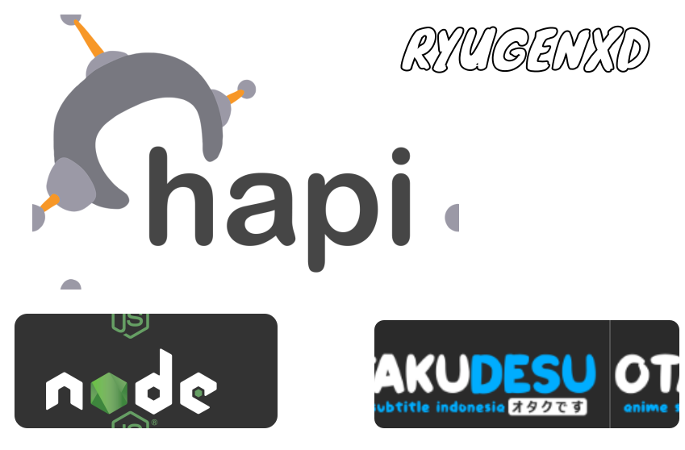

## OTAKUANIME API


Inspired By https://github.com/arakbae/otakuanime


####  OTAKUDESU ANIME SUBTITLE INDONESIA 

| Features | Options | Status |
| --- | --- | --- |
| **Ongoing Anime** | `GET /ongoing?pagination=<number>` | ✅ |
| **Complete Anime** | `GET /completed?pagination=<number>` | ✅ |
| **Search Anime** | `GET /search?q=<query>` | ✅ |
| **Genres Anime** | `GET /genres` | ✅ |
| **Detail Anime** | `GET /detail?id=<id_name>` | ✅ |


____


<div align="center" width="100%">
    
</div>


# Todos:   
    - Install & Import Puppeteer
    - Clicks And Follow The Links For Scraping The Source


# API DOCS

```
method:"GET", 
path:"/detail", 
params: ?id={id bisa didapat di GET /}
```
